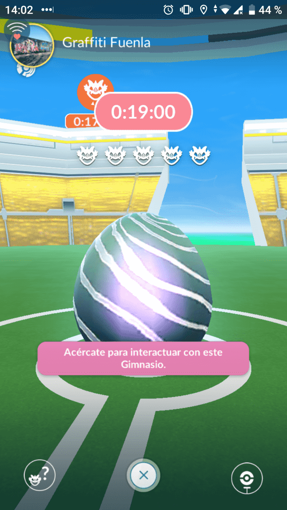
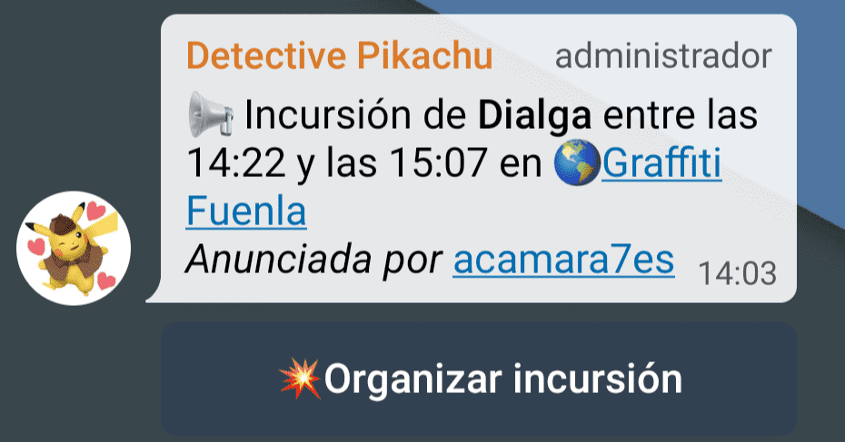
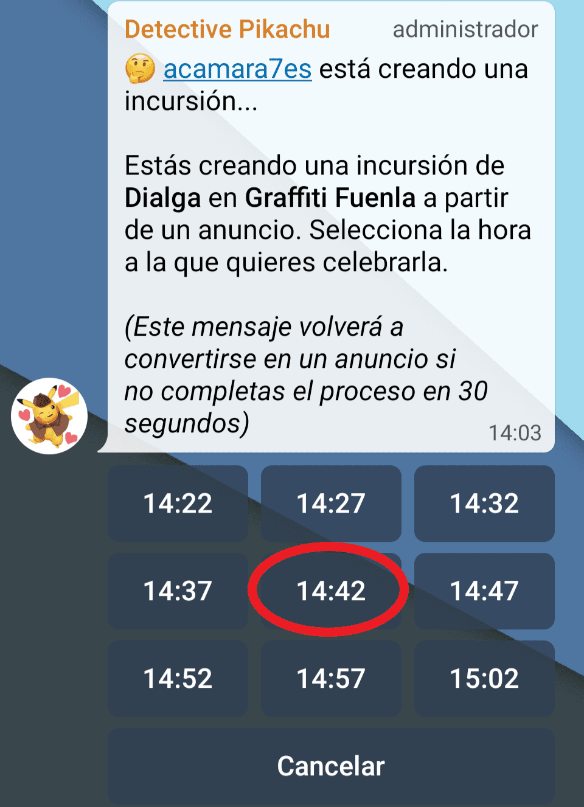
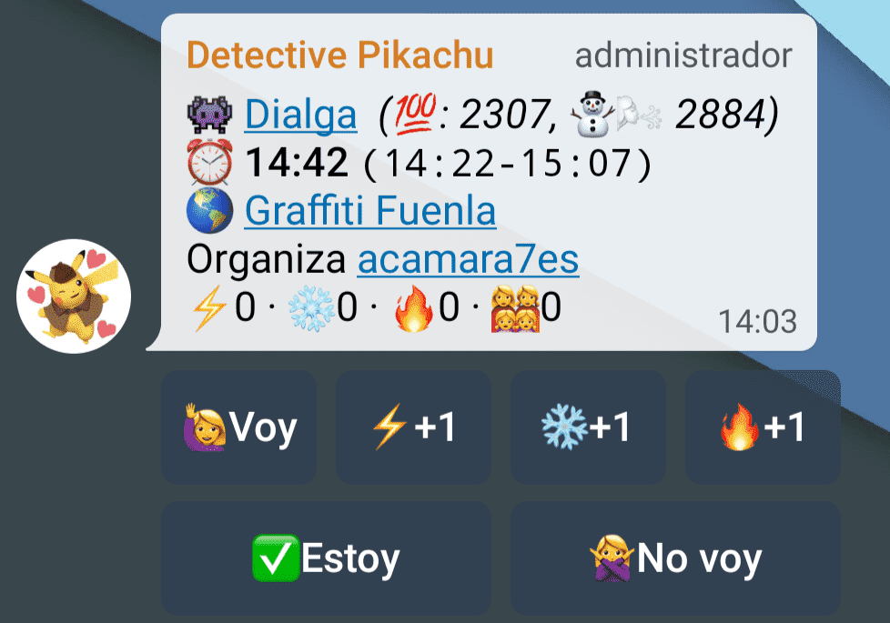
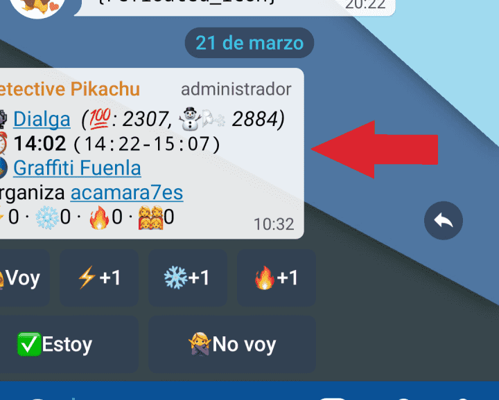
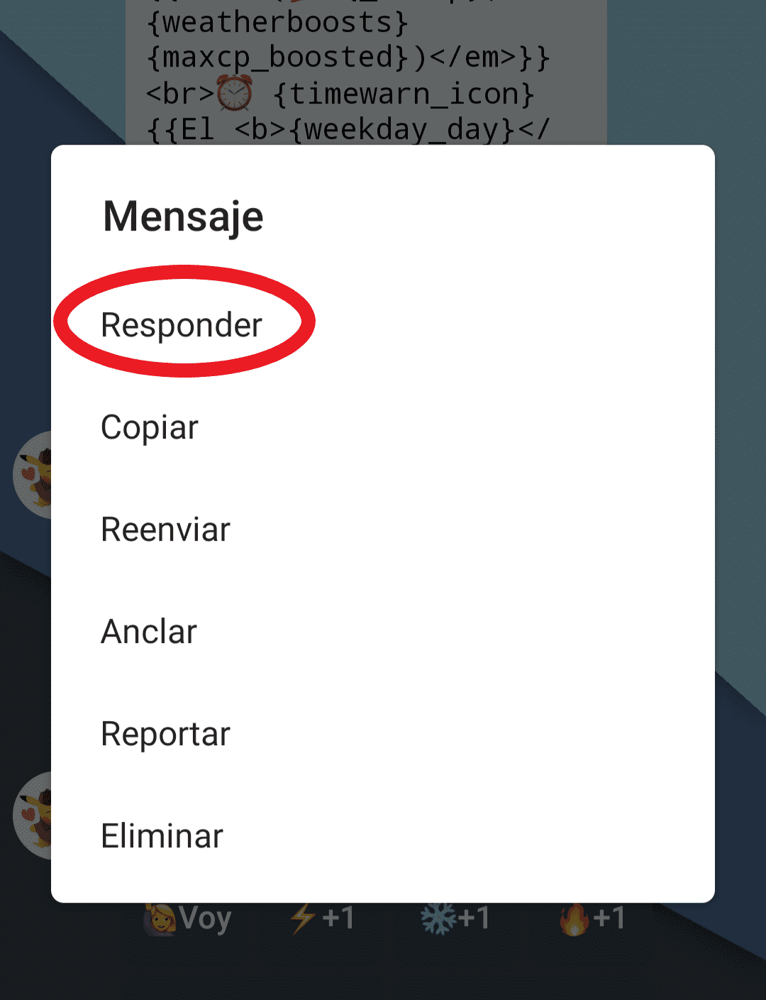

1. [Requisitos para crear una raid](#requisitos-para-crear-una-raid)
2. [Métodos para crear una raid](#métodos-para-crear-una-raid)
    1. [Con captura de pantalla](#con-captura-de-pantalla)
    2. [Con comando](#con-comando)
3. [Modificar una raid](#modificar-una-raid)
    

# Requisitos para crear una raid
Cualquiera que esté registrado con el bot Detective Pikachu puede organizar una raid siempre que siga las siguientes indicaciones:

1. En este grupo **solo se permiten raids de niveles 5**. Las de nivel 4 se organizarán a través del grupo de charla y para las de nivel inferior hay otro grupo al que puedes acceder desde el grupo de charla.

2. Muy importante, **revisa que no se haya creado ya la raid que quieres poner**, es importante evitar que las raids se repitan para mantener el orden y saber realmente cuántos hay apuntados en cada raid.

3. La hora a la que se organice la raid debe ser siempre **la misma de la eclosión del huevo** (Con excepción de lo que se indica en el punto 4). No hay que redondear, si el huevo abre a las 12:02 la raid debe ponerse a las 12:02.

4. **Si hay 2 o más legendarios disponibles**, la hora de ataque será 20 minutos después de abrir el huevo. Al usar el comando para crear la raid hay que poner como pokemon "*n5*" y cuando se abra el huevo editar la raid para indicar el pokemon (ver apartado [Modificar una raid](#modificar-una-raid)).

# Métodos para crear una raid
Estos son los métodos disponibles para crear raids en este grupo, si tienes cualquier duda o problema al crear la raid pregunta en el grupo de charla y alguien te ayudará, pero no dejes la raid con errores ya que puedes perjudicar a otros jugadores.

### Con captura de pantalla
Este método es bastante sencillo pero depende mucho de que el bot reconozca correctamente los datos de la captura. Si falla, deberás editarla de forma manual después. 
Para usar este método debes enviar al grupo una captura de pantalla (no una foto al móvil) como la que se ve a continuación **que esté recién hecha**, si se deja pasar tiempo antes de enviar la captura, el bot detectará mal la hora de inicio y la raid estará mal (además supondrá un aviso o *warn* para el usuario que envió la captura).  

Si el bot reconoce los datos correctamente creará un "anuncio" de la incursión, a partir del cual se puede crear la raid pulsando en el botón "*Organizar incursión*" y seleccionando la hora adecuada según las normas comentadas [más arriba](#Requisitos-para-crear-una-raid).
  

### Con comando
Este método es más "artesanal" pero es más difícil cometer errores una vez se sabe utilizar. Solo hay que escribir en el grupo el siguiente comando sustituyendo las palabras en mayúsculas por los datos adecuados:
~~~
/raid POKEMON HORA GIMNASIO
~~~
- **POKEMON**: El nombre del jefe de incursión o "*n5*" solo si hay varios legendarios.
- **HORA**: La hora a la que se ha quedado para la batalla.
- **GIMNASIO**: El nombre del gym.
Ejemplo de un huevo de Lugia que abre a las 20:14 en el gym Fuente Los Patos:
~~~
/raid Lugia 20:34 Fuente Los Patos
~~~
# Modificar una raid
### Ediciones
Ya sea por un error al crearla o porque haya varios legendarios disponibles, en ocasiones es necesario editar algún dato de las raids. Sin embargo, solo pueden hacerlo el creador de la raid y los administradores. Si no es tu caso y ves que hay algo mal en alguna raid avisa en el grupo de charla indicando el error y aportando una captura de pantalla a ser posible para corregirlo cuanto antes.

Para editar una raid solo hay que *responder* al mensaje de Pikachu de la raid en el grupo y usar el comando correspondiente a cada dato. Para cambiar el pokemon o la hora de ataque no es necesario usar comando, basta con poner simplemente el dato corregido, pero para el resto de casos sí (Pikachu te envía por privado una lista con todos los comandos).

### Responder a un mensaje
Para poder responder a un mensaje hay 2 formas de hacerlo:
- Deslizar el mensaje hacia la izquierda.  

- Pulsar una vez en el mensaje y elegir "Responder" en el menú.  

