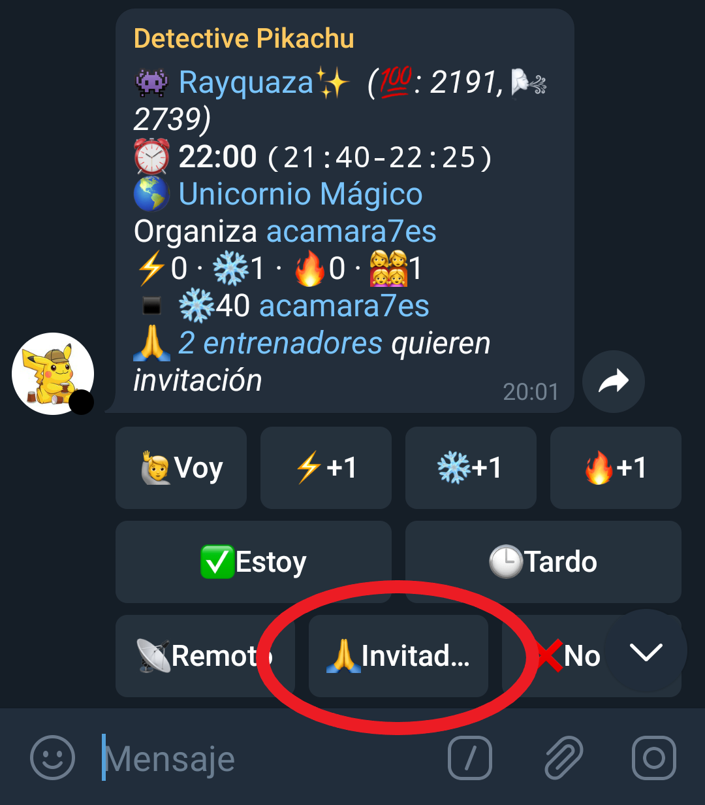
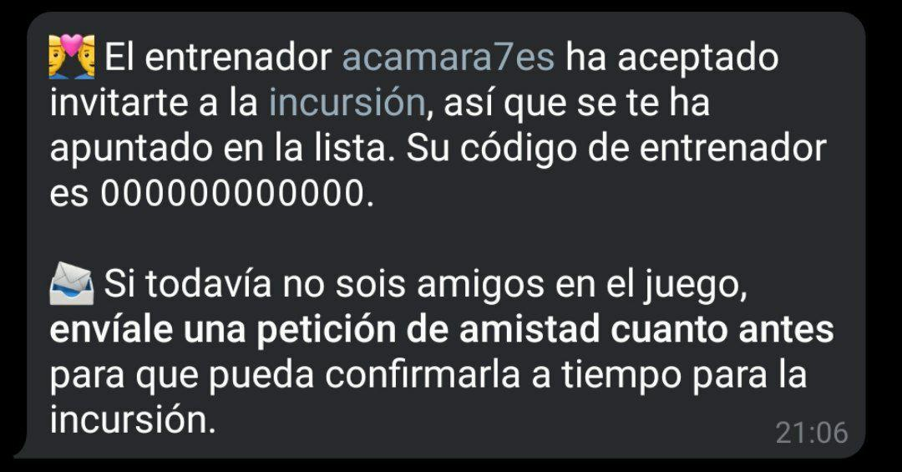
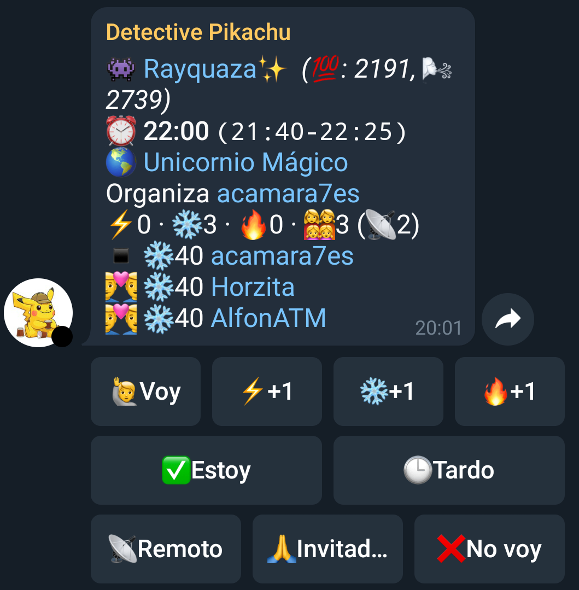
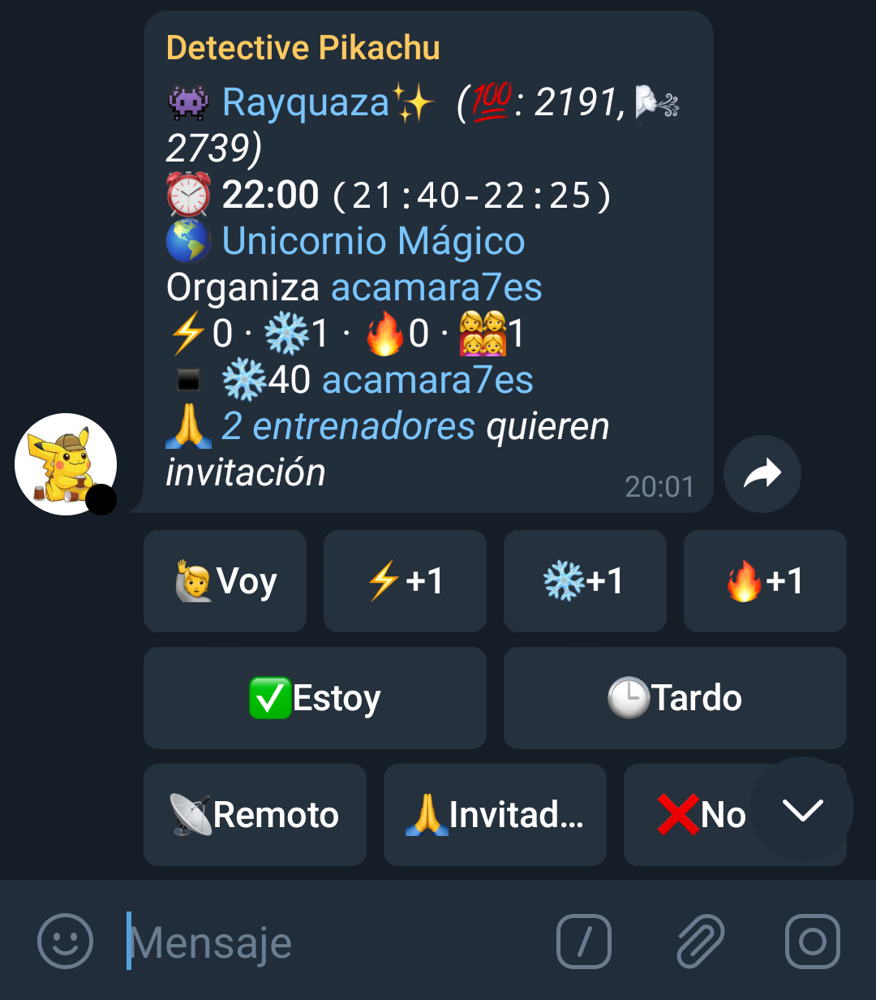
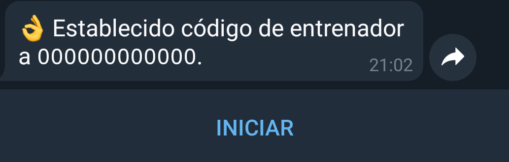
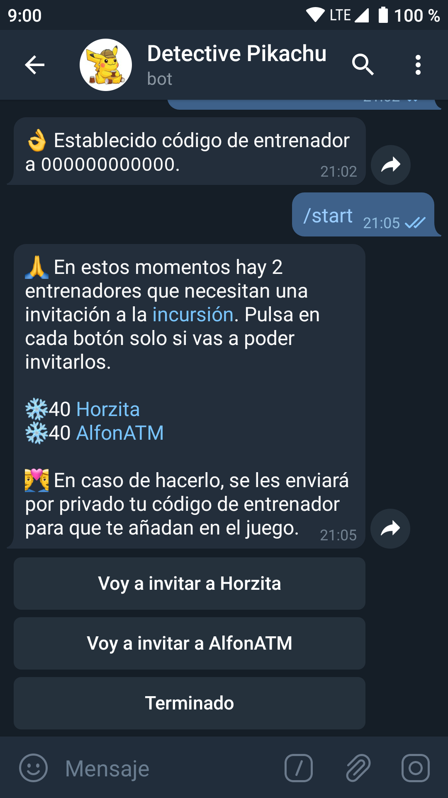

Las invitaciones son una buena forma de hacer amigos en el juego y ayudar a otros a hacer incursiones. El bot [@detectivepikachubot](https://t.me/detectivepikachubot) ha incluido un sistema para manejar esta circunstancia. Sin embargo antes de nada es importante recordar las limitaciones que tienen las invitaciones en el juego: 

- Un entrenador puede enviar hasta 5 invitaciones a una incursión.
- Alguien que ha sido invitado a una incursión no puede invitar a nadie a esa misma incursión.
- Un entrenador invitado usa pase remoto y ocupa una plaza en el cupo de remotos.
- Actualmente como máximo solo puede haber 10 entrenadores en remoto en un mismo grupo al hacer la incursión.
- Los invitados no necesitan código de acceso al grupo privado, entran directamente a la sala con quien les ha invitado (siempre que haya sitio).

Además hay que tener en cuenta que este sistema está previsto para usarse tal y como funciona el bot, es decir 1 cuenta por persona, por tanto si quieres que te inviten a más de una cuenta es importante que leas al final la sección de *Preguntas Frecuentes*.

**IMPORTANTE:** Las invitaciones deben usarse de forma correcta. Nunca invites a gente que no esté apuntada en la incursión, podrías dejar a alguien fuera (incluso a quien has invitado tú). Si se descubre que alguien invita a gente sin apuntar en la raid podrá ser expulsado del grupo de forma permanente.

# Añadir el código de amigo.

Lo primero para usar esta función será estar registrado en el bot y mandarle nuestro código de amigo. Para ello se pueden utilizar 3 opciones **siempre en el chat individual** con el bot:
- Enviándole el mensaje que genera el juego para compartir el código:
~~~
¡Comencemos una buena amistad en Pokémon GO! ¡Mi código de Entrenador es 0000 0000 0000!
~~~
- Usando el comando `/fc` y a continuación el código.
~~~
/fc 0000 0000 0000
~~~
- Enviándole una captura del juego en la que se vea el código (No recomendado)

En cualquiera de los casos el bot te confirmará que lo ha recibido. Recuerda actualizar el código en el bot si lo has cambiado dentro del juego si no nadie podrá añadirte.

**IMPORTANTE:** Una vez establecido el código deja pasar unos minutos antes de pedir invitaciones ya que el bot tarda un poco en procesar que ya has añadido el código de amigo y te dirá que debes añadirlo aunque acabes de hacerlo.

# Pedir invitaciones.
Para pedir que alguien te invite a una incursión es tan sencillo como pulsar el nuevo botón de "`🙏 Invitadme`" (no al de "*Voy*"), desde entonces entrarás en un listado que aparecerá en la raid hasta que alguien quiera invitarte.

Una vez que alguien haya aceptado tu petición recibirás un mensaje de confirmación con el código de amigo de la persona que te va a invitar para que le añadas como amigo en el juego si no le tienes todavía.

En la lista de la incursión aparecerás con el icono 👨‍❤️‍👨

Ahora ya solo queda esperar a la hora prevista con el juego abierto y aceptar la invitación para unirse a la incursión

# Aceptar invitaciones.
Una vez apuntado en la incursión puedes ver el listado de gente que quiere ser invitada a la misma pulsando en el enlace que aparece en la parte inferior de la lista.

Te abrirá el chat privado con el bot pero no verás nada aún, por limitaciones de Telegram **debes pulsar en el botón de INICIAR** para que el bot te pueda enviar el mensaje. 

Una vez hecho eso verás la lista de aquellos que necesitan una invitación. Pulsa en el botón correspondiente a cada uno para aceptar su petición de forma individual y cuando acabes pulsa en *Terminado*.

A cada uno de los entrenadores que invites les llegará por privado la confirmación de que les vas a invitar junto a tu código para que te añadan si todavía no sois amigos en el juego.

# Preguntas Frecuentes.

- **Tengo más de una cuenta y el bot no me deja poner más códigos de amigo, ¿Cómo hago para que me inviten a las otras cuentas?**
Una vez que alguien haya aceptado invitarte a la incursión habla con él/ella por privado y pregunta si podría invitar también a las otras. Solo si te contesta que sí y una vez que os tengáis de amigos en el juego deberás borrarte de la incursión pulsando en "*No voy*" y apuntarte de nuevo como remoto con los +1 correspondientes. 

- **Estoy de vacaciones en la otra punta del mundo pero quiero que me inviten a una raid aquí, ¿hay algún problema?**
No hay limitaciones de distancia en las invitaciones así que mientras sigas lo que se ha explicado en esta guía el único "problema" será la diferencia horaria.

