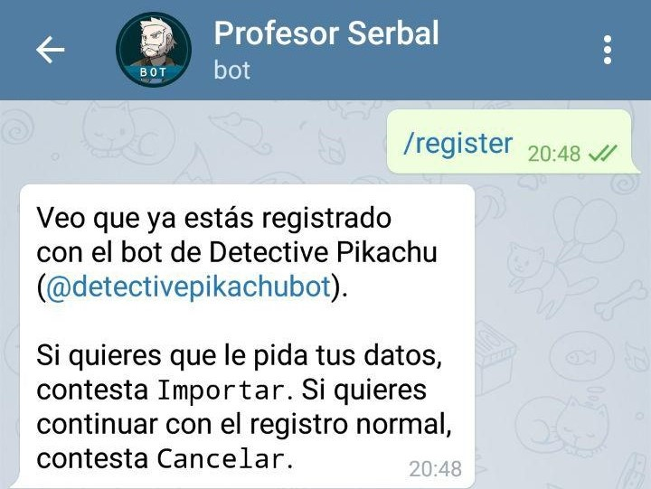
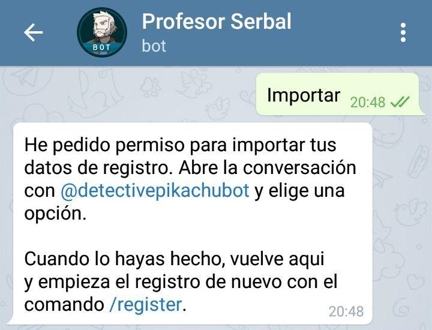
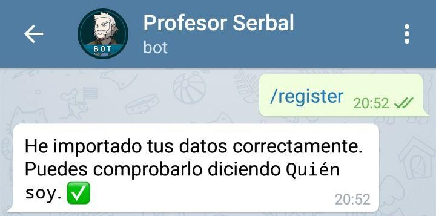

1. [Registro](#registro)
    1. [Reenviando el perfil de Detective Pikachu](#reenviando-el-perfil-de-detective-pikachu)
    2. [Importando datos de Detective Pikachu](#importando-datos-de-detective-pikachu)
    3. [Sin Detective Pikachu](#sin-detective-pikachu)
2. [Registrar código de amigo](#registrar-código-de-amigo)  
    
    
# Registro
Lo primero que necesitas saber es como registrarte con Serbal para poder usar el resto de sus funciones. Si ya estás registrado con el Detective Pikachu apenas vas a tardar 30 segundos en hacerlo (recomendado).  

En cualquier caso lo primero es abrir **chat privado** con el bot del [Profesor Serbal](https://t.me/profserbalbot) y decirle `/register` o `Quiero registrarme`, ahora tenemos 3 posibilidades:

### Reenviando el perfil de Detective Pikachu
Esta forma es posiblemente la más rápida pero tienes que estar validado con el bot de Pikachu y con los datos correctos (si tienes mal el nivel mándale una captura de tu perfil a Pikachu antes de empezar).  

Primero debes abrir el chat privado con [@detectivepikachubot](https://t.me/detectivepikachubot) y decirle `/profile`, después **reenvía** (no copiar el texto) el mensaje de respuesta al [Profesor Serbal](https://t.me/profserbalbot) y reconocerá tus datos.

### Importando datos de Detective Pikachu
Esta forma es más sofisticada que la anterior e igualmente tienes que estar correctamente validado con Detective Pikachu. A cambio, los datos de ambos bots estarán más integrados y en el futuro podrás cambiar el nivel en ambos más fácilmente.  

En cuanto le pongas el `/register` Serbal detectará que ya estás registrado con Detective Pikachu y te preguntará si quieres que importe los datos que tiene Pikachu sobre ti.

Si le respondes *Cancelar* iniciarás el proceso de registro tal y como se describe en el apartado *Sin Detective Pikachu*, pero si le respondes *Importar* te dirá que tienes que darle permiso para acceder a los datos del Detective Pikachu (si no lo tiene ya).

Ahora has recibido un mensaje en el chat privado con Detective Pikachu para autorizar a Serbal a acceder a los datos. Pulsa en **Aceptar**

Por último una vez aceptado el traspaso de información de Pikachu a Serbal tienes que volver a escribir de nuevo `/register` en el chat con Serbal para completar el proceso.

### Sin Detective Pikachu
Despues del `/register` te irá pidiendo sucesivamente tu **nombre en el juego**, tu **nivel** y tu **color**. Una vez hecho necesitarás validar estos datos con el comando `/validate` (o `Quiero validarme`), entonces Serbal te pedirá una captura con unos requisitos. Una vez enviada y revisada por los administradores del bot estarás validado correctamente.

# Registrar código de amigo
Serbal tiene una funcionalidad que permite registrar y obtener los códigos de amigo de los miembros del grupo que lo permitan. 
Lo primero que debes hacer es registrar tu código de amigo en el bot, para ello hay 2 formas (ambas **por privado** con el bot)
1. Compartir con Serbal directamente el mensaje de "*¡Comencemos una buena amistad...*"
2. Con el comando `/setfc` seguido de los 12 números del código (sin espacios).
