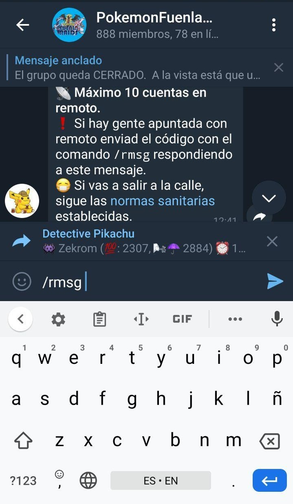

Los pases remotos han llegado al juego para quedarse, lo que supone algunos cambios en la forma de hacer raids que deben tenerse muy en cuenta por ambos lados, tanto presenciales como remotos. Todos estamos en el mismo juego y debemos respetarnos todos. Por lo que hay que aprender a gestionar raids en las que hay tanto remotos como gente presencial en el propio gym.

# Guía para remotos

### 1. Asegúrate de que Detective Pikachu pueda mandarte mensajes.
El bot [@detectivepikachubot](https://t.me/detectivepikachubot) es una parte fundamental en este sistema así que hay que asegurarse de que nos llevamos bien con él. Para poder participar en raids usando pase remoto es necesario que tengas abierta la conversación con el bot ya que de otro modo **no podrá enviarte mensajes**. Para comprobar que todo está bien tienes que ir al chat con [@detectivepikachubot](https://t.me/detectivepikachubot) y ponerle `/profile` si todo va bien te mostrará los datos que el bot tiene de ti. 

Aprovecha para actualizarlos si algo está mal, si solo has subido nivel mándale una captura de tu perfil y si has cambiado de nombre o color debes volver a registrarte.

### 2. Activar las notificaciones flotantes para el bot (Recomendado).
En muchos teléfonos el hecho de pasar del juego a Telegram para mirar el código hace que el juego se cierre y haya que volver a iniciarlo con la cuenta atrás de la raid en marcha. Por ello se recomienda activar las notificaciones personalizadas para el bot e incluir la notificación emergente. Cuando te llegue el mensaje con el código se abrirá una ventana con el mensaje completo y no tendrás que salir del juego para verlo.

Para activarlas, desde la conversación con el bot pulsamos arrriba en el nombre, después en **Notificaciones** y luego en **Personalizar**. 

Una vez hecho esto hay que darle a "**Activar notificaciones personalizadas**" y después abajo dejar activada la **Notificación pop-up**

### 3. Prepárate para la incursión.
A la hora prevista para la incursión debes estar preparado para entrar. **El código te puede llegar en cualquier momento** pero ten en cuenta que puede tardar unos minutos debido a los minutos de cortesía para la gente que llegue tarde a la incursión de forma presencial. Una vez enviado el código **tendrás menos de 2 minutos para entrar** así que no te despistes. 

Es altamente recomendable **tener un equipo preparado con los pokemon que vayas a usar en el combate**, así aunque entres con poco tiempo podrás ayudar haciendo daño en la raid. Para ver los mejores pokemon para enfrentarse al jefe de incursión pulsa en el nombre del pokemon en el mensaje de la raid en el grupo.

# Guía para presenciales

### 1. Recordatorios básicos
Lo primero es lo primero, la gente que va como presencial debe actuar como se ha hecho siempre de acuerdo con las normas: Acércate al gym con el grupo (aunque vivas justo encima), cuando llegues usa el bot para indicarlo pulsando en "**✅Estoy**" en el mensaje de la raid (importante para que tanto remotos como presenciales sepan que ya están todos) y esperad al menos 5 minutos si falta gente. 

### 2. Enviar el código
Lo más práctico es hacerlo entre 2 personas (si las hay). Una de ellas crea el grupo privado en el juego y la otra tiene preparado el Telegram con el mensaje de la raid en el grupo [citado](crear_raids#responder-a-un-mensaje) (Pulsa en el mensaje y dale a "_Responder_" o desliza el mensaje hacia la izquierda) y el comando `/rmsg` puesto, más o menos así para que sea más rápido escribir el código:

En cuanto se crea el código se escribe con el comando en el grupo y se envía a los remotos para que tengan el máximo tiempo posible para entrar. **Ejemplo: `/rmsg pikachu pikachu pikachu`**. Si todo va bien el que manda el mensaje debería recibir 2 mensajes del bot: Uno con una copia del mensaje enviado y otro con la lista de usuarios a los que se lo ha enviado.

### 3. Posibles problemas
- **Pikachu dice que "_No ha podido enviar el mensaje por privado a xxx_"**
  - Esto se debe a que ese usuario tiene el bot bloqueado tal y como se explica en el apartado correspondiente en la guía de remotos. No es necesario salir y crear otro grupo.
- **Pikachu dice que "_❌ No tienes permiso para enviar mensajes a incursiones en este grupo._"**
  - Esto se debe a que se ha intentado enviar el mensaje a una raid errónea en la que no está apuntado quien envía el mensaje. Se debe crear un nuevo grupo privado para la raid y mandar el código como se explicó antes poniendo atención a qué mensaje se está citando en el grupo.
  
