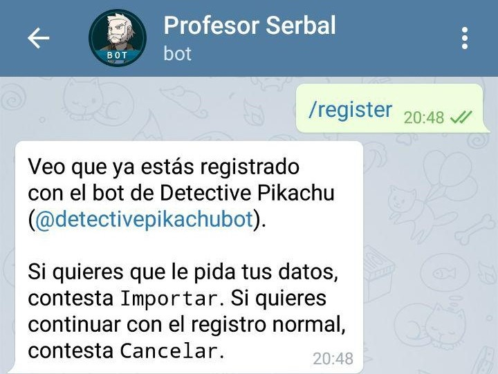
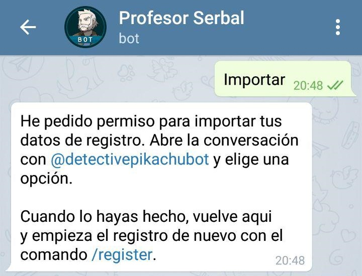
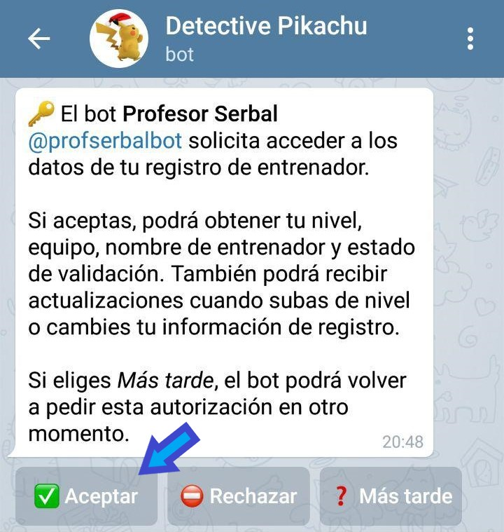
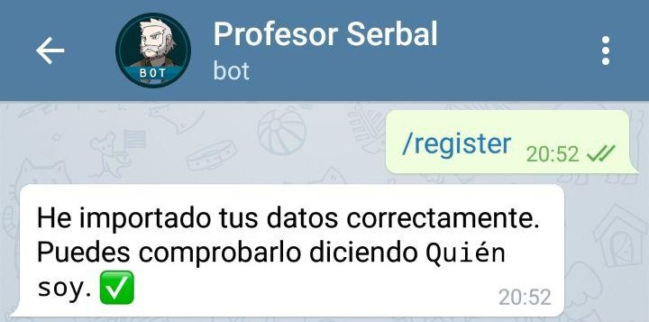

1. [Registro](#registro)  
    1. [Sin Detective Pikachu](#sin-detective-pikachu)  
    2. [Con Detective Pikachu](#con-detective-pikachu)  
2. [Nidos](#nidos)  
    1. [Registrar nidos](#registrar-nidos)  
    2. [Borrar nidos](#borrar-nidos)  
    3. [Pedir nidos](#pedir-nidos)  
3. [Códigos de amigo](#códigos-de-amigo)  
    1. [Registrar código de amigo](#registrar-código-de-amigo)  
    2. [Lista de códigos de amigo](#lista-de-códigos-de-amigo)  
4. [Llamar a los administradores](#Llamar-a-los-administradores)  
5. [Otras funciones](#otras-funciones)  
    1. [Buscador de 100IV](#buscador-de-100iv)  
    2. [Tablas integradas](#tablas-integradas)  
    3. [Quién es… y Está aquí…](#quién-es-y-está-aquí)  
    4. [Buscador de anclado](#buscador-de-anclado)
    
    
# Registro
Lo primero que necesitas saber es como registrarte con Serbal para poder usar el resto de sus funciones. Si ya estás registrado con el Detective Pikachu apenas vas a tardar 30 segundos en hacerlo (recomendado).
En cualquier caso lo primero es abrir **chat privado** con el bot del [Profesor Serbal](https://t.me/profserbalbot) y decirle `/register`, ahora tenemos 2 posibilidades:

### Sin Detective Pikachu
Te irá pidiendo sucesivamente tu **nombre en el juego**, tu **nivel** y tu **color**. Una vez hecho necesitarás validar estos datos con el comando `/validate` (o `Quiero validarme`), entonces Serbal te pedirá una captura con unos requisitos. Una vez enviada y revisada por los administradores del bot estarás validado correctamente.

### Con Detective Pikachu
En cuanto le pongas el `/register` Serbal detectará que ya estás registrado con Detective Pikachu y te preguntará si quieres que importe los datos que tiene Pikachu sobre ti.

Si le respondes *Cancelar* iniciarás el proceso de registro tal y como se describe en el apartado *Sin Detective Pikachu*, pero si le respondes *Importar* te dirá que tienes que darle permiso para acceder a los datos del Detective Pikachu (si no lo tiene ya).

Ahora has recibido un mensaje en el chat privado con Detective Pikachu para autorizar a Serbal a acceder a los datos. Pulsa en **Aceptar**

Por último una vez aceptado el traspaso de información de Pikachu a Serbal tienes que volver a escribir de nuevo `/register` en el chat con Serbal para completar el proceso.

# Nidos
### Registrar nidos
~~~
/addnest pokemon ubicacion
~~~
o
~~~
Registrar nido de pokemon en ubicacion
~~~
Al terminar de añadir el nido Serbal pedirá que envíes una ubicación para confirmar su posición y que sea más sencillo de encontrar.

### Borrar nidos
Solo pueden borrar nidos los admin y quien que lo haya registrado. La ubicación debe ser exactamente igual a la que se utilizó para registar el nido, así que se recomienda copiarla.
~~~
/delnest pokemon ubicacion
~~~
o
~~~
Borrar nido de pokemon en ubicacion
~~~

### Pedir nidos
~~~
/listnests
~~~
o
~~~
Lista de nidos completa
~~~

# Códigos de amigo
Serbal tiene una funcionalidad que permite registrar y obtener los códigos de amigo de los miembros del grupo que lo permitan. 

### Registrar código de amigo
Lo primero que debes hacer es registrar tu código de amigo en el bot, para ello hay 2 formas (ambas **por privado** con el bot)
1. Compartir con Serbal directamente el mensaje de "*¡Comencemos una buena amistad...*"
2. Con el comando `/setfc` seguido de los 12 números del código (sin espacios).

### Lista de códigos de amigo
Una vez que Serbal conozca tu código de amigo, si quieres incluirlo en la lista de amigos del grupo debes escribir en el mismo grupo `/regfc`.
Para pedir la lista de códigos de amigo del grupo usa el comando `/listfc`. Recuerda que solo te mostrará aquellos que hayan seguido los pasos anteriores, no el de todos los miembros.

# Llamar a los administradores
Es posible hacer llegar una notificación a todos los administradores del grupo usando un mensaje de la siguiente forma:
~~~
@admin mensaje
~~~
Para que funcione y llegue la notificación a los administradores el mensaje **debe empezar con @admin**. De todas formas Serbal indicará si la mención ha sido enviada correctamente.
Te pedimos que uses esta función con cuidado y solo cuando sea necesaria, recuerda las palabras que le dijeron a Spiderman:

>Un gran poder conlleva una gran responsabilidad

# Otras funciones
### Buscador de 100IV
Serbal puede ayudarte a buscar entre tus pokemon aquellos con 100% de IV. Para ello el bot genera el texto necesario para buscar en tu lista de pokemon aquellos que pueden tener 100% de IV de una especie concreta usando el comando (se recomienda usarlo **en privado** con el bot):
~~~
/searchstr pokemon
~~~
Si el pokemon tiene alguna forma diferente (Ej: Deoxys o los Alola) debes ponerla después del nombre del pokemon (`deoxys ataque` o `marowak alola`)  
**Importante**: Que un pokemon aparezca al hacer la búsqueda en el juego con el texto que devuelve el comando no garantiza que sea 100%, para ello tendrás que recurrir a la valoración del líder del equipo o a apps externas, pero si no aparece es que no puede ser 100%. 

### Tablas integradas
El bot dispone de una importante cantidad de "tablas" o infografías sobre el juego, algunas mejores o más útiles que otras. En [este enlace](https://xblau.com/serbal/tables) podéis ver todas las disponibles, os recomendamos usarlas **en privado** con el bot para no saturar el grupo.

### Quién es... y Está aquí...
Los pongo juntos porque están muy relacionados. Con el comando `Quien es` o `/whois` puedes obtener información de un jugador como su nombre de entrenador, su color, nivel y el código de amigo si lo tiene registrado. Se puede usar de 2 formas, junto con el nombre de entrenador `Quien es mejorEntrenador`o respondiendo a un mensaje de la persona sobre la que quieras preguntar.

Con el comando `Esta aqui NombreEntrenador` o `/ishere NombreEntrenador` podrás saber si el entrenador que buscas se encuentra en el grupo en el que estás preguntando y le mencionará para que os podáis poner en contacto por privado (muy útil por ejemplo para acordar subidas de amistad, por ejemplo).

### Buscador de anclado
A veces ocurre que el mensaje anclado "*desaparece*" para algunos usuarios. Si alguna vez te ocurre y necesitas consultarlo solo tienes que poner en el grupo:
~~~
Serbal, anclado
~~~
Y te responderá citando el último mensaje anclado que conozca.
